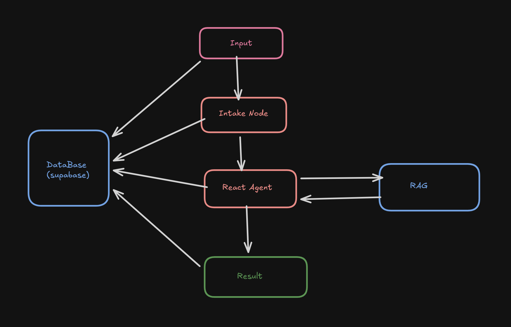

# 🏥 ClaimFlow AI - Insurance Claim Adjudication System

<div align="center">


**An AI-powered insurance claim processing system that automates claim intake, policy verification, risk assessment, and routing decisions.**

[Getting Started](#-getting-started) •
[Installation](#-installation) •
[Workflow](#-workflow) •
[Features](#-features)

</div>

The ClaimFlow AI system processes insurance claims through an intelligent multi-stage pipeline:



## 🛠️ Tech Stack

| Category | Technologies |
|----------|-------------|
| **Backend** | Python, FastAPI, LangChain, OpenAI GPT-4o |
| **Vector Store** | Pinecone |
| **Frontend** | React 18, TypeScript, Vite, Tailwind CSS |
| **UI Components** | Shadcn/ui, Framer Motion |
| **Styling** | Tailwind CSS, CSS Variables |

---

## 🚀 Getting Started

### Prerequisites

Before you begin, ensure you have the following installed:

- **Python** 3.10 or higher
- **Node.js** 18+ and npm (or Bun)
- **Git**

### Required API Keys

You'll need the following API keys:

- **OpenAI API Key** - For GPT-4o LLM
- **Pinecone API Key** - For vector database

---

## 📦 Installation

### Step 1: Clone the Repository

```bash
git clone https://github.com/lokeshpanthangi/plum_01.git
cd plum_01
```

### Step 2: Backend Setup

Open a terminal and run the following commands:

```bash
# Create a virtual environment
python -m venv venv

# Activate the virtual environment
# On Windows:
venv\Scripts\activate
# On macOS/Linux:
source venv/bin/activate

# Install Python dependencies
pip install -r requirements.txt
```

### Step 3: Configure Environment Variables

Create a `.env` file in the root directory:

```env
OPENAI_API_KEY=your_openai_api_key_here
PINECONE_API_KEY=your_pinecone_api_key_here
PINECONE_INDEX_NAME=your_index_name
```

### Step 4: Frontend Setup

Open a **new terminal** and navigate to the frontend directory:

```bash
# Navigate to frontend directory
cd frontend

# Install dependencies using npm
npm install

# Or if you prefer Bun:
bun install
```

---

## ▶️ Running the Application

### Start the Backend Server

In the first terminal (with virtual environment activated):

```bash
# From the root directory
python main.py
```

The backend will start at: `http://localhost:8000`

### Start the Frontend Development Server

In the second terminal:

```bash
# From the frontend directory
cd frontend
npm run dev

# Or with Bun:
bun run dev
```

The frontend will start at: `http://localhost:5173`

---

## 🔄 Workflow

### Stage 1: Intake Node 📥

The intake node receives claims in multiple formats:
- **Text Input** - Direct claim descriptions
- **Image Upload** - Medical bills, receipts (uses GPT-4o Vision)
- **PDF Upload** - Scanned documents, forms

**Output:** Structured claim data including:
- Member ID & Name
- Policy Number
- Treatment Date
- Claim Amount
- Diagnosis
- Doctor & Hospital Information

### Stage 2: Agent Executor 🤖

The AI agent analyzes the claim using:
- **RAG (Retrieval Augmented Generation)** - Queries the Pinecone vector store for relevant policy documents
- **Policy Matching** - Compares claim against coverage terms
- **Decision Making** - Determines APPROVED, REJECTED, or PARTIAL approval

**Output:** Decision with reasoning, approved amount, and policy references

### Stage 3: Risk Assessment ⚠️

Evaluates the claim risk level:
- **Confidence Score** - How certain the AI is about the decision (0-100%)
- **Risk Category** - Low, Medium, or High
- **Confidence Reasons** - Explanations for the confidence level

### Stage 4: Routing Decision 🛤️

Determines the processing path:
- **Fast-Track** ✅ - Approved claims with high confidence
- **Standard Processing** 📋 - Partial approvals or medium confidence
- **Manual Review** 🔍 - Rejected claims or low confidence requiring human oversight

---

## 📁 Project Structure

```
plum_01/
├── 📂 agents/
│   ├── intake_node.py      # Multi-format claim intake processing
│   ├── simple_agent.py     # AI agent with RAG capabilities
│   └── state.py            # Pydantic models for state management
├── 📂 rag/
│   └── rag.py              # Pinecone RAG implementation
├── 📂 frontend/
│   ├── 📂 src/
│   │   ├── 📂 components/  # React components
│   │   ├── 📂 hooks/       # Custom React hooks
│   │   ├── 📂 pages/       # Page components
│   │   └── 📂 lib/         # Utilities
│   ├── package.json
│   └── vite.config.ts
├── main.py                  # FastAPI backend entry point
├── config.py                # Configuration and LLM setup
├── requirements.txt         # Python dependencies
└── .env                     # Environment variables
```

---

## 🔌 API Endpoints

| Method | Endpoint | Description |
|--------|----------|-------------|
| `GET` | `/` | Health check |
| `POST` | `/process-claim-stream/` | Process text claim (streaming) |
| `POST` | `/process-claim-file-stream/` | Process image/PDF claim (streaming) |
| `POST` | `/api/process-claim/text` | Process text claim (non-streaming) |
| `POST` | `/api/process-claim/file` | Process file claim (non-streaming) |
| `POST` | `/api/ingest-document/` | Ingest documents into vector store |

---

## 🎯 Usage Example

1. Open the application at `http://localhost:5173`
2. Choose input method (Text or File Upload)
3. Enter claim details or upload a document
4. Click "Process Claim"
5. Watch the real-time processing stages
6. Review the results:
   - **Claim Summary** - Extracted information
   - **Policy Decision** - APPROVED/REJECTED/PARTIAL
   - **Risk Assessment** - Confidence score and risk level
   - **Routing** - Where the claim goes next

---

## 🤝 Contributing

Contributions are welcome! Please feel free to submit a Pull Request.

1. Fork the repository
2. Create your feature branch (`git checkout -b feature/AmazingFeature`)
3. Commit your changes (`git commit -m 'Add some AmazingFeature'`)
4. Push to the branch (`git push origin feature/AmazingFeature`)
5. Open a Pull Request

---

## 📄 License

This project is licensed under the MIT License.

---

<div align="center">

## Thanks

**Thank you for Giving the Assignment to prove my worth!**

If you found this project helpful, please contact me.

Built with ❤️ by [Lokesh Panthangi](https://github.com/lokeshpanthangi)

---

*Automating insurance claim processing with the power of AI* 🚀

</div>
